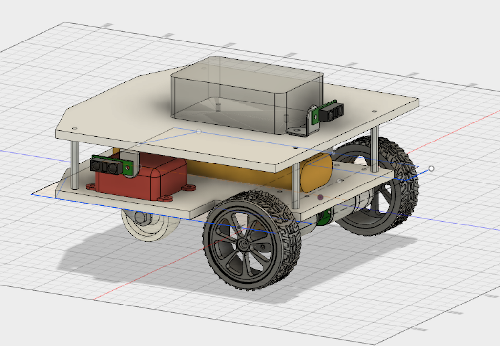

# B2 - Hide & Seek Robot
#### ...and more importantly, an educational platform for me, my kids, and my friends.

 

### *This project is not yet complete*

This is my ROS project consisting of the custom code for my robot named **B2**.

B2 is a 2-wheel differential drive robot. Its initial design goal is to create a hide & seek robot that will roam a single floor in a multi-room house looking for a person who is hiding. This goal was suggested by my elementary school-age kids when I was searching for a goal for which to build a robot from scratch.

My daughter picked the name **B2**. Prior to this robot, we build a light-follower robot partially following [a design](http://www.robotoid.com/my-first-robot/rbb-bot-phase2-part1.html) from the author of [Robot Builder's Bonanza](http://amzn.to/2vk4dpO). That first robot she named Beddo, from a [scene in Despicable Me 2](https://youtu.be/htcQ6CIKqGg?t=1m6s). Therefore she wanted this robot to be named **B2**.

### [Visit the B2 Wiki for project progress and documentation](https://github.com/sheaffej/b2/wiki)

||
|:---:|
|Initial Fusion 360 design|
